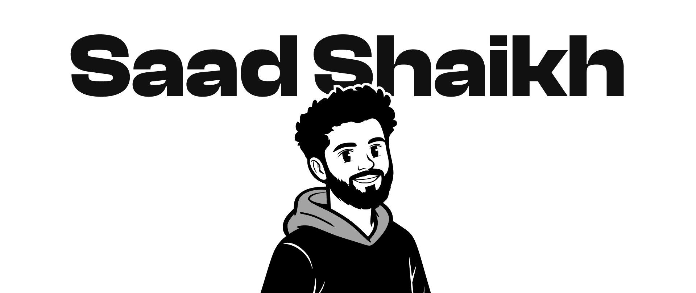
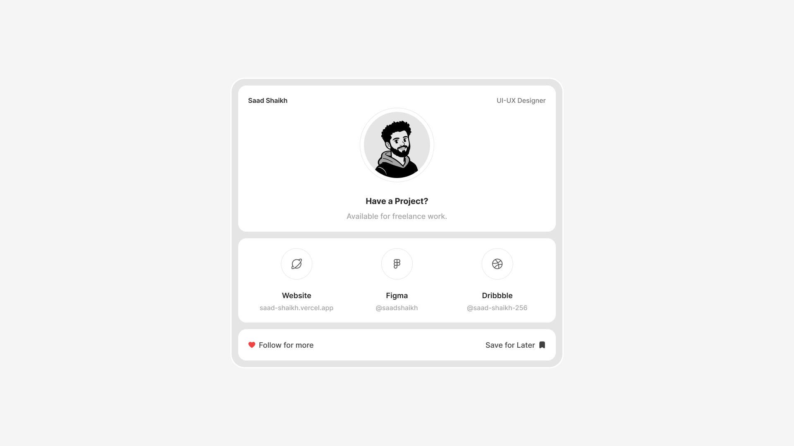

# Hey there! I'm Saad 👋

### Jr. UI/UX Designer | Frontend Developer | AI First Designer

## About Me

I'm a Jr. UI/UX Designer and Frontend Developer who focuses on building responsive, thoughtful, and user friendly digital products. I've been designing UI for over 2+ years and specialize in bringing those designs to life with code.

I recently completed my MCA and currently working as an AI First Designer at Huptech, alongside freelancing on design and development projects for clients across web, brand identity, and product design.

> Designing experiences that connect people with technology, guided by a curious mind, a developer's heart, and a designer's eye.

---

## 🚀 What I'm Up To

- 💼 Working as an AI First Designer at Huptech, handling website design, brand design, and graphic design
- 🧑‍💻 Freelancing on frontend and UI/UX projects using React, Tailwind CSS, and Figma
- 🎨 Designing UI/UX in Figma, from wireframes to interactive prototypes
- 🧠 Building brand identity systems, not just interfaces
- 💡 Exploring how AI tools fit into a real design workflow, not just as a gimmick

---

## 📫 Get in Touch

- ✉️ Email: [shaikhsaad256@gmail.com](mailto:shaikhsaad256@gmail.com)
- 📝 Resume: [View CV](https://docs.google.com/document/d/1sTOJkoEVwtGCfM_mwu0rzsyDBTLWEpE7Klex5ZcAnDk/edit?usp=sharing)
- 🌐 Website: [saad-shaikh.vercel.app](https://saad-shaikh.vercel.app)

---

## 🌐 Find Me On

---

## 🛠 Tech Stack

- **Languages:** HTML, CSS, JavaScript, PHP, Python
- **Frameworks:** React, Laravel, Django
- **Styling:** Tailwind CSS, Media Queries, Responsive Design
- **Design Tools:** Figma (Wireframing, UI Kits, Prototypes), AI Design Tools

---

## 🤓 Fun Stuff

When I’m not coding or designing, you’ll probably find me:

- Browsing UI inspiration on Behance or Dribbble
- Refactoring old code just to make it look cleaner
- Learning something new about frontend performance or accessibility

---

<picture>
  <source media="(prefers-color-scheme: dark)" srcset="https://raw.githubusercontent.com/saad-shaikh-256/saad-shaikh-256/output/github-snake-dark.svg" />
  <source media="(prefers-color-scheme: light)" srcset="https://raw.githubusercontent.com/saad-shaikh-256/saad-shaikh-256/output/github-snake.svg" />
  
</picture>

---

## 🤝 Let's Collaborate

Feel free to reach out if you'd like to collaborate or discuss projects related to UI design, frontend development, or brand identity work. Always happy to connect and build cool stuff together.

